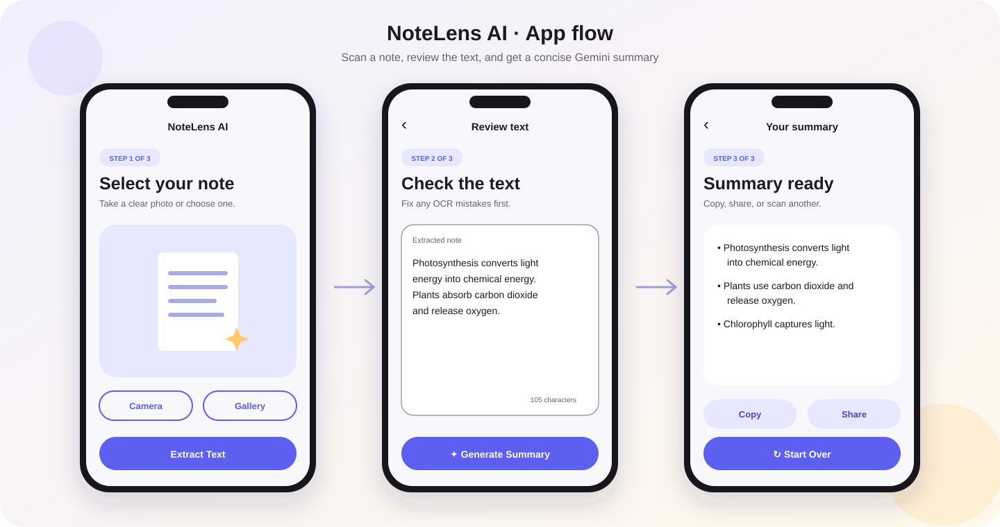

# NoteLens AI



NoteLens AI is a deliberately small Android portfolio app that turns a photo of a note into editable text and a concise summary. It demonstrates a complete AI workflow without authentication, a database, history, or unnecessary screens.

## App flow

1. **Select Note** — take a photo or choose one from the system photo picker.
2. **Extracted Text** — ML Kit recognizes the text and the user can correct it.
3. **Summary** — Gemini creates a short summary that can be copied or shared.

Printed text gives the best OCR results. Clear handwriting can work, but accuracy depends on lighting, focus, writing style, and how much of the image the note occupies.

## Tech stack

- Kotlin only
- AGP 9 built-in Kotlin support
- Jetpack Compose and Material 3
- Clean Architecture + MVVM
- Navigation Compose
- StateFlow and Kotlin Coroutines
- ML Kit Text Recognition v2 with the bundled Latin model
- Firebase AI Logic with Gemini
- Firebase App Check
- JUnit unit tests
- GitHub Actions CI

## Architecture

The project stays in one app module because it has only three screens, but dependencies still point inward:

```text
presentation
├── screens + Compose components
├── navigation
└── NoteLensViewModel
         │
         ▼
domain
├── ExtractTextUseCase
├── GenerateSummaryUseCase
└── repository interfaces
         ▲
         │
data
├── MlKitTextRecognitionRepository
├── FirebaseSummaryRepository
└── DemoSummaryRepository
```

The ViewModel owns UI state, validation, loading states, workflow decisions, and navigation effects. Use cases contain reusable domain rules. Repository implementations contain ML Kit and Firebase details.

## Run immediately in demo mode

The repository intentionally does not include a personal `google-services.json`. Without that file, the app still builds and runs:

- ML Kit performs real on-device OCR.
- A small local extractive summarizer powers the final screen.
- The summary screen clearly displays a **Demo summary** badge.

This makes the public repository safe and lets reviewers explore the whole flow.

## Enable the real Gemini summary

1. Open the [Firebase console](https://console.firebase.google.com/) and create a project.
2. Add an Android app with package name `com.portfolio.notelensai`.
3. In **Firebase AI Logic**, choose **Get started** and select the Gemini Developer API.
4. Download the real `google-services.json` into `app/google-services.json`.
5. Sync Gradle. The build automatically detects the file and switches from `DemoSummaryRepository` to `FirebaseSummaryRepository`.
6. Run the app and generate a summary.

The included model name is `gemini-3.5-flash`. It is kept in `BuildConfig` so it can be changed in one place inside `app/build.gradle.kts`.

`app/google-services.json.example` shows the expected location and shape, but it is not usable configuration. The real file is ignored by Git.

## Configure App Check

App Check protects calls made directly from the Android client.

### Debug or emulator

1. In Firebase, open **App Check** and register the Android app.
2. Run a debug build and trigger a summary.
3. In Logcat, search for `DebugAppCheckProvider`.
4. Copy the generated debug token into the Firebase console under **Manage debug tokens**.
5. Never commit that token.

### Release

The release source set uses the Play Integrity App Check provider. Register the app's SHA-256 signing certificate and configure Play Integrity in Firebase before distributing a release build.

## Build

Requirements:

- Android Studio Quail or newer
- JDK 17
- Android SDK 37

The project uses AGP 9's built-in Kotlin support. Do not add the legacy
`org.jetbrains.kotlin.android` plugin; it is incompatible with AGP 9's new DSL.

On Windows:

```powershell
.\gradlew.bat testDebugUnitTest assembleDebug
```

On macOS or Linux:

```bash
./gradlew testDebugUnitTest assembleDebug
```

The debug APK is generated at:

```text
app/build/outputs/apk/debug/app-debug.apk
```

## Project highlights

- Exactly three destinations with a normal back stack and a cleared stack on **Start Over**
- Camera capture through `FileProvider`
- Android system photo picker instead of broad storage permissions
- Editable OCR output before data is sent to Gemini
- Loading, empty-result, and retry-friendly error states
- Dark theme support
- Compose previews for all three screens
- Firebase credentials and App Check debug tokens excluded from version control
- CI builds successfully without private Firebase configuration by using demo mode

## License

MIT
